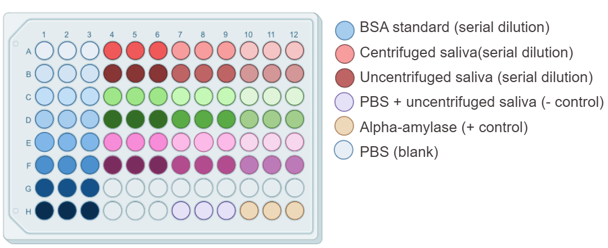

# Speeksel BMR

## Project overview
Dit project onderzoekt het effect van protease activiteit op alfa-amylase activiteit in speeksel
De BCA-assay wordt gebruikt om de totale eiwitconentratie te bepalen in zowel gecentrifugeerd en ongecentrifugeerde monsters.
De data-analyse is geautomatiseerd met een R script dat ruwe ClarioStar exports in totale eiwitconcentraties.
Deze eiwitconcentraties worden gebruikt om de monsterinhoud te normaliseren voor verdere analysen met de FRET en CNPG3 assay.

----

### Plate lay-out

De onderstaande figuur toont de 96-well plate lay-out voor de BCA assay.

De **BSA standaarden** aanzwezig  in concentraties van 50, 100, 200, 400, 600, 800 & 1000 µg/mL.  
De **speekselmonsters** aanwezig in verdunningsfactoren van 5x, 10x & 20x.

----

## Raw data formaat

De ruwe data moet voldoen aan het volgende formaat:

Well,Abs  
A01,0.123  
A02,0.123  
A03,0.123  

---

### Script

- `script/BCA_analysis.R`
  - Leest raw data in
  - Corrigeert met PBS als blanco
  - Genereert kallibratielijn met de lineaire formule, R² & spreiding (stdev)
    - Gebruiker keuze: GO/NOGO
  - Berekent gemiddelde en standaarddeviatie per sample
    - Gebruiker keuze: beste verdunningsfactor
  - Genereert totale eiwitconcentratie per donor
    - Gebruiker keuze: bevestiging
  - Append automatisch naar donor file in `data/total_protein_donors.csv`
